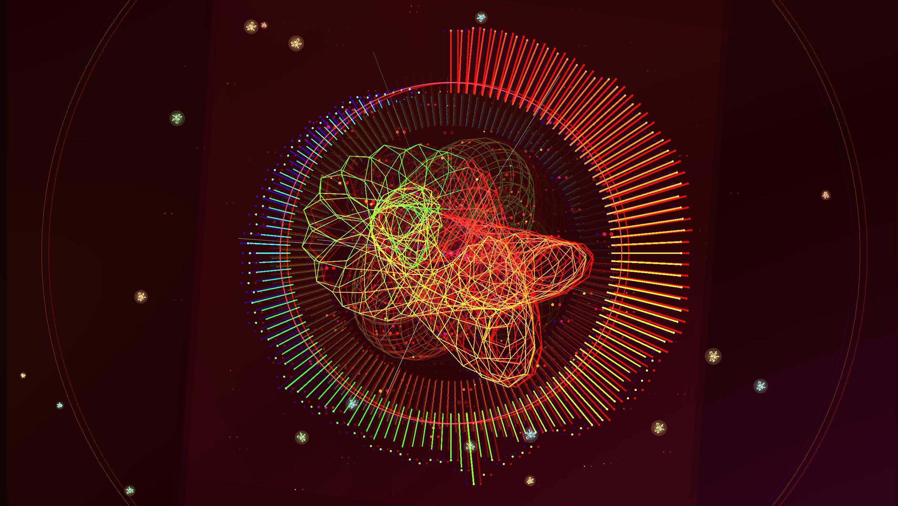

# Music Visualizer

Real-time audio visualizer written in Go, designed as a background for DJ sets. Captures the PC's audio output and generates reactive abstract 3D animations driven by kick, hi-hat, bassline, BPM, and musical key.



## Requirements

- Go 1.21+
- Linux with PulseAudio or PipeWire
- Development libraries: `libX11-devel`, `mesa-libGL-devel`, `pulseaudio-libs-devel`, `alsa-lib-devel`

### Installing dependencies (Fedora/Bazzite)

```bash
# In a Fedora distrobox:
sudo dnf install -y golang libX11-devel libXi-devel libXrandr-devel \
  libXxf86vm-devel mesa-libGL-devel libXcursor-devel libXinerama-devel \
  alsa-lib-devel pulseaudio-libs-devel gcc
```

## Usage

```bash
# List audio devices
go run . -list

# Set the monitor source to capture audio output
pactl list sources short
pactl set-default-source <name>.monitor

# Run
go run .
go run . -fullscreen
go run . -device 3            # specific device by index
go run . -width 2560 -height 1440 -fullscreen
```

### Flags

| Flag | Default | Description |
|------|---------|-------------|
| `-width` | 1920 | Window width |
| `-height` | 1080 | Window height |
| `-fullscreen` | false | Start in fullscreen |
| `-list` | false | List audio devices and exit |
| `-device` | -1 | Capture device index (-1 = system default) |

### Keyboard shortcuts

| Key | Action |
|-----|--------|
| **ESC** | Quit |
| **F11** | Toggle fullscreen |
| **F1** | Toggle debug overlay (FPS, BPM, key, graphs) |

## Architecture

```
music-visualizer/
  main.go                    Entry point, flag parsing
  audio/
    capture.go               Audio capture via PulseAudio (malgo/miniaudio)
    devices.go               Device enumeration
  beat/
    detector.go              Kick, hi-hat, BPM, and buildup detection
  dsp/
    fft.go                   FFT + Hann window + logarithmic binning
    key.go                   Key detection (Camelot wheel)
  visualizer/
    visualizer.go            Ebiten game loop, effect coordination
    feedback.go              Feedback warp (zoom + rotation + trail)
    plasma.go                Animated color field (background)
    torus.go                 3D rotating wireframe torus
    particles.go             3D explosive particles (kick)
    sparkles.go              Starburst rays (hi-hat)
    orbs.go                  Luminous spheres with waveform border (bass)
    color.go                 HSV to RGB conversion
```

## Audio pipeline

```
Monitor Source (PulseAudio/PipeWire)
        |
        v
  audio.Capture (malgo, PulseAudio backend)
        |
        +---> Short buffer (2048 samples, ~46ms)
        |         |
        |         +---> dsp.Spectrum() -> 128 logarithmic bands
        |         |         |
        |         |         +---> Visual AGC (volume normalization)
        |         |         +---> Exponential smoothing (alpha 0.85)
        |         |
        |         +---> beat.Detector.Update() (raw bands, pre-AGC)
        |                   |
        |                   +---> Kick detection (spectral flux 27-60Hz)
        |                   +---> Hi-hat detection (spectral flux 5-12kHz)
        |                   +---> BPM estimation (average kick intervals)
        |                   +---> Buildup detection (hi-hat rate vs BPM)
        |
        +---> Long buffer (262144 samples, ~5.9s)
                  |
                  +---> dsp.KeyDetector.Update() (every ~2s)
                            |
                            +---> Chromagram (12 pitch classes)
                            +---> Krumhansl-Schmuckler correlation
                            +---> Camelot key + BaseHue()
```

## Beat detection

### Kick drum (27-60 Hz, bands 5-20)

**Algorithm: Spectral Flux Onset Detection**

1. Average energy across kick bands
2. AGC normalization (peak with decay 0.9995/frame)
3. Exponential smoothing (alpha 0.35)
4. Compute flux: `normalized_energy - previous_smoothed_value`
5. If flux > 0.30 AND gap > 300ms: kick detected
6. `KickStrength` = min(flux / threshold, 1.0)
7. BPM computed from average of last 8 kick intervals

### Hi-hat / Cymbal (5-12 kHz, bands 101-120)

Same spectral flux algorithm with different parameters:
- Flux threshold: 0.30
- AGC decay: 0.9992
- Minimum gap: 60ms (hi-hat can be very fast)

### Buildup detection

1. Count hi-hat hits/second over a 2-second window
2. Thresholds scale with BPM:
   - Normal groove: `(BPM/60 * 2) * 1.8` hits/s (eighth notes)
   - Full buildup: `(BPM/60 * 2) * 4.5` hits/s (32nd/64th note rolls)
3. Asymmetric smoothing:
   - Fast rise (blend 0.15): captures roll immediately
   - Slow decay (0.998): sustains through brief gaps
   - Fast collapse (0.92): on silence (bass + hihat energy < 0.1)

### BPM to SpeedFactor

Maps the real DJ range (124-155 BPM) to a visual speed multiplier (0.6-2.2x):

| BPM | SpeedFactor | Effect |
|-----|-------------|--------|
| 124 | 0.6 | Slow, relaxed animations |
| 140 | 1.4 | Medium speed |
| 155 | 2.2 | Fast, energetic animations |

Everything scaled by BPM (torus rotation, hue cycling, shockwave decay, particle speed, ray lifetime) varies by 3.7x between the extremes.

## Key detection (Camelot)

**Algorithm: Krumhansl-Schmuckler with chromagram**

1. FFT on 262144-sample buffer (~5.9s, ~0.17Hz resolution)
2. For each FFT bin between 27.5Hz and 4.2kHz:
   - Compute pitch class: `((round(12 * log2(freq/440)) % 12) + 12 + 9) % 12`
   - Accumulate magnitude into corresponding bucket (0=C, 1=C#, ..., 11=B)
3. Normalize chromagram (sum = 1)
4. Pearson correlation against all 24 Krumhansl-Schmuckler profiles (12 major + 12 minor)
5. Key with highest correlation wins
6. Updated every ~2 seconds (120 frames)

### Camelot to color mapping

The Camelot wheel (circle of fifths) maps directly to HSV hue:

| Camelot | Hue | Color |
|---------|-----|-------|
| 1A/1B | 0/15 | Red |
| 2A/2B | 30/45 | Orange |
| 3A/3B | 60/75 | Yellow |
| 4A/4B | 90/105 | Lime |
| 5A/5B | 120/135 | Green |
| 6A/6B | 150/165 | Teal |
| 7A/7B | 180/195 | Cyan |
| 8A/8B | 210/225 | Sky blue |
| 9A/9B | 240/255 | Blue |
| 10A/10B | 270/285 | Purple |
| 11A/11B | 300/315 | Magenta |
| 12A/12B | 330/345 | Pink |

The global hue oscillates continuously but is attracted toward the detected key's color, with pull strength proportional to detection confidence. Harmonically compatible keys (adjacent on the Camelot wheel) have similar colors, so transitions between tracks produce smooth color shifts.

## Visual effects

### Feedback warp (feedback.go)

MilkDrop-style effect: each frame the previous frame is drawn slightly zoomed and rotated, with fade. Creates hypnotic trails.

- **Zoom**: 1.0025 + energy * 0.004 (+ buildup * 0.6)
- **Rotation**: baseline 0.01 deg/frame, scaled with energy and BPM
- **Fade**: 0.75 per RGB channel (short, clean trails)

### 3D wireframe torus (torus.go)

Toroid wireframe with 28 rings x 18 segments, continuous rotation on 3 axes.

- **Rotation speed**: proportional to SpeedFactor (BPM)
- **Distortion**: impulse on kick + continuous during buildup
- **Color**: global hue + gradient along the torus (120 degrees of variation)
- **Line width**: grows with mix energy

### 3D particles (particles.go)

180 particles explode from center on each kick in random spherical directions.

- **Speed/lifetime**: scaled with SpeedFactor
- **Max pool**: 1200 particles
- **Projection**: perspective with FOV 2.5

### Ring spectrum (visualizer.go)

128 frequency bars arranged in a circle, with peak dots.

- **Base radius**: 25% of screen height
- **Ring pulse**: jumps on kick (+8% height), decays with easing
- **Bars**: length = band magnitude * height * (0.12 + pulse * 0.06)
- **Peak dots**: track peak and decay slowly (0.97/frame)

### Shockwave (visualizer.go)

Concentric rings expanding outward on each kick.

- **Expansion**: 1.8% height/frame (+ BPM scaling)
- **Fade**: 0.88/frame (+ BPM scaling)
- **Cap**: max 8 simultaneous shockwaves
- **Antialiased**: yes

### Chromatic aberration (visualizer.go)

On kick, the canvas is redrawn with the red channel shifted right and blue shifted left (3D anaglyph effect).

- **Shift**: 6 + KickStrength * 18 pixels
- **Decay**: 0.85/frame (scaled with BPM)
- **Blend**: additive for R/B halos, SourceOver for base layer

### Starburst rays (sparkles.go)

Bright rays from center toward edges on hi-hat hits.

- **Count**: 12-50 rays per hit (increases with buildup)
- **Length**: 30-80% of screen radius
- **Lifetime**: ~5 frames (decay 0.15 * SpeedFactor)
- **Antialiased**: yes

### Glitch strips (visualizer.go)

Horizontal slices of the frame displaced sideways during buildup.

- **Count**: 2-20 strips (proportional to BuildupIntensity)
- **Height**: 8-88 pixels
- **Offset**: up to 100px lateral displacement
- **Activation**: only when BuildupIntensity > 0.05

### Camera shake (visualizer.go)

Random displacement of the entire frame.

- **Buildup**: up to 55px X, 40px Y
- **Kick**: +15px on kicks with KickStrength > 0.5
- **Applied**: also during chromatic aberration

### Plasma (plasma.go)

Animated color field generated by 4 interfering sine waves.

- **Resolution**: screen / 14 (low for performance)
- **Oversize**: 2x with radial vignette (hides edges in feedback rotation)
- **Brightness**: 0.04 + |v| * 0.06 + energy * 0.03 (very dark, background texture)
- **Alpha**: fades from 150 at center to 0 at edges
- **Speed**: increases with mix energy + hi-hat energy + BPM

### Orbs (orbs.go)

18 luminous spheres at screen edges with waveform-distorted borders.

- **Position**: outer edges only (avoid center 22-78% zone)
- **Base radius**: 3-9px, pulsation 0.7-1.0x with bass energy (60-200Hz)
- **Border**: 48 segments, radius modulated by audio waveform: `radius + sample * radius * 1.8`
- **Rotation**: individual, random speed, changes on each kick
- **Glow**: 3 concentric circles with decreasing alpha
- **Drift**: speed and direction randomized on each kick

## Rendering pipeline

Drawing order per frame:

```
1. Feedback advance (zoom + rotate previous frame)
      |
2. Plasma (animated background on canvas, inside feedback loop)
      |
3. Torus (3D wireframe on canvas)
      |
4. Particles (3D kick explosion on canvas)
      |
5. Ring spectrum (bars + peak dots on canvas)
      |
6. Shockwaves (expanding kick rings on canvas)
      |
--- Composite canvas -> screen ---
      |
7. Chromatic aberration (on kick) OR Screen shake
      |
8. Glitch strips (during buildup)
      |
9. Orbs (on screen, no feedback trail)
      |
10. Starburst rays (hi-hat, on screen)
      |
11. Debug overlay (F1)
```

## AGC (Automatic Gain Control)

The visualizer is completely volume-independent thanks to two separate AGCs:

1. **Visual AGC**: normalizes the 128 spectrum bands against the recent peak (decay 0.999/frame). Animations react to the *structure* of the mix, not the absolute volume level.

2. **Beat detector AGC**: separate normalization for kick (decay 0.9995) and hi-hat (decay 0.9992). Beat detection works identically at any volume level.

## Debug overlay (F1)

The panel displays:

- **FPS**: current frame rate
- **BPM**: estimated + SpeedFactor
- **Key**: Camelot key (e.g., "8B C maj") with confidence
- **Chroma shift**: active chromatic aberration pixels
- **Ring pulse**: ring pulse amplitude
- **AGC peak**: normalization peak level
- **Hihat rate**: hits/second (last 2s)
- **Buildup**: intensity 0-1

### Graphs (last 8 seconds)

- **KICK** (red): detected kick timeline
- **HIHAT** (cyan): detected hi-hat timeline
- **BASS** (orange): 60-200Hz energy curve
- **MIX** (green): overall mid/high energy curve
- **HIHAT E** (cyan): hi-hat band energy curve

## Detected frequencies

| Element | Hz range | Bands | Usage |
|---------|----------|-------|-------|
| Kick drum | 27-60 Hz | 5-20 | Beat detection, shockwave, chroma, particles |
| Bassline/Sub | 60-200 Hz | 20-39 | Orb pulsation |
| Hi-hat/Cymbal | 5000-12000 Hz | 101-120 | Starburst rays, buildup detection |
| Key detection | 27.5-4200 Hz | Direct FFT | Camelot key detection |
| Visual spectrum | 20-22050 Hz | 0-127 | Ring spectrum, plasma |

## Low-latency tuning

The visualizer minimizes audio-to-visual latency through:

| Source | Latency |
|--------|---------|
| Audio callback period | ~5.8ms (256 frames) |
| Band smoothing | ~1 frame (alpha 0.85) |
| Kick detection smoothing | ~2.5 frames (alpha 0.35) |
| PulseAudio/PipeWire pipeline | ~20-40ms (system dependent) |

For further reduction, configure PipeWire:
```bash
# ~/.config/pipewire/pipewire.conf.d/low-latency.conf
context.properties = {
    default.clock.quantum = 256
    default.clock.min-quantum = 128
}
```

## Dependencies

| Library | Usage |
|---------|-------|
| [ebiten/v2](https://github.com/hajimehoshi/ebiten) | 2D game engine, rendering, input |
| [malgo](https://github.com/gen2brain/malgo) | Audio capture (miniaudio Go bindings) |

## License

MIT
